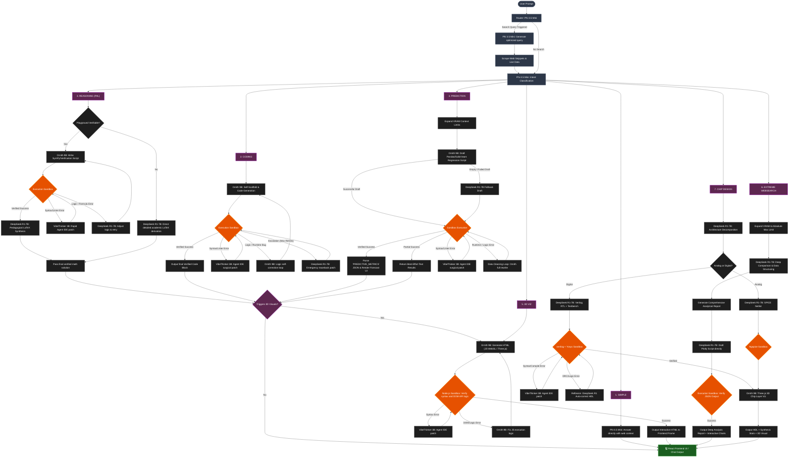

<div align="center">

# 🧠 DeepThink AIOS

### Fully Local Multi-Agent AI Operating System

*An orchestrated fleet of specialized LLMs running on consumer hardware — zero cloud dependencies.*


</div>

---

DeepThink AIOS is a **production-grade, fully offline multi-agent system** that routes user queries through specialized LLM pipelines for coding, reasoning, data science, 3D visualization, and semiconductor chip design — all running locally with dynamic hardware scaling from Intel iGPUs to NVIDIA H100s.

> [!CAUTION]
> This project is in active development. The multi-sandbox architecture and Dynamic Memory Allocator push consumer hardware to its limits.

---

## ✨ Key Features

- **7-Way Intelligent Routing** — Intent-aware pipeline selection across coding, reasoning, prediction, search, 3D viz, and chip design
- **Self-Scaffolding Code Generation** — Ornith 9B autonomously plans and writes code in a single unified trajectory
- **AST-Aware Self-Healing** — Surgical patching via Python AST extraction instead of fixed-line windows
- **Parallel Web Scraping** — ThreadPoolExecutor-based concurrent page fetching (N×timeout → 1×timeout)
- **Dual Sandbox Verification** — Polyglot execution across 13 languages with kernel-level isolation
- **Chip Design EDA Pipeline** — Full Verilog/SPICE synthesis with SkyWater 130nm PDK mapping
- **Dynamic Memory Allocator (DMA)** — LRU model swapping enabling 7B+ models on 16GB RAM systems

---

## 🤖 Model Fleet

| Model | Size | Role |
|---|---|---|
| **Ornith 1.0-9B** | 9B (Q6_K) | Primary code generation, 3D visualization, ML scripting, self-correction |
| **DeepSeek-R1-7B** | 7B (Q6_K) | Deep reasoning, chain-of-thought, logic planning, pedagogical synthesis |
| **VibeThinker 3B** | 3B (Q6_K) | Agent IDE syntax linter — surgical AST-aware patching |
| **Phi-3.5-Mini** | 3.8B (Q6_K) | Intent classification, routing, search query generation |
| **Qwen-2.5-VL-7B** | 7B (Q6_K_XL) | Vision parsing, OCR, screenshot/chart transcription |

---

## 🔀 Pipeline Architecture



### Pipeline Details

| # | Pipeline | Generator | Linter | Description |
|---|---|---|---|---|
| 1 | **Simple** | Phi-3.5 | — | Direct answers with optional web context |
| 2 | **Coding** | Ornith 9B | VibeThinker | Self-scaffolded code gen → Sandbox verify → AST patch loop |
| 3 | **Reasoning** | DeepSeek-R1 | VibeThinker | SymPy/SciPy verification scripts → LaTeX synthesis by R1 |
| 4 | **Prediction** | Ornith 9B | VibeThinker | ML regression with pandas/scikit-learn, data cleaning loops |
| 5 | **Extreme Search** | DeepSeek-R1 | — | Parallel scraping + deep thematic synthesis + Plotly charts |
| 6 | **3D Visualization** | Ornith 9B | VibeThinker | Three.js / Plotly.js interactive scenes in iframe sandbox |
| 7 | **Chip Design** | Ornith 9B + R1 | VibeThinker | 3-stage EDA: Architecture → HDL verify → 3D chip layout |

---

## 🛡️ System Components

### Sandbox Isolation
- **3-Tier Security:** Linux `unshare` namespaces + `chroot` jailing + resource limits
- **13 Languages:** Python, C, C++, Java, JS, Go, Rust, Bash, TS, Verilog, SystemVerilog, SPICE, Yosys TCL
- **Pre-Execution SAST:** Static security scanning blocks injection, reverse shells, and exfiltration

### Self-Healing Loop
```
Draft Code → Sandbox Execute → [Success] → Output
                                [Failure] ↓
                    AST Context Extraction (exact broken function)
                                ↓
                    VibeThinker: Surgical Search/Replace Patch
                                ↓
                    [Fixed] → Re-execute → Output
                    [Failed] → Ornith Full Rewrite → Re-execute
                    [Failed] → DeepSeek-R1 Escalation → Nuclear Reset
```

### Dynamic Memory Allocator (DMA)
- **LRU Eviction:** Hot-swaps models between VRAM ↔ System RAM
- **KV Cache Quantization:** INT8 KV cache halves VRAM usage
- **GPU Offloading:** KV cache pinned to VRAM via `offload_kqv`
- **Auto-Scaling:** Context windows scale from 8K (iGPU) → 64K (H100)

---

## 🛠️ Tech Stack

| Layer | Technologies |
|---|---|
| **Frontend** | React 19, Vite, Vanilla CSS (Glassmorphism), react-markdown, Plotly.js, Three.js |
| **Backend** | FastAPI, Uvicorn, llama-cpp-python, ChromaDB (RAG), DuckDuckGo Search |
| **Sandbox** | numpy, scipy, sympy, z3-solver, scikit-learn, biopython, rdkit, astropy, cryptography |
| **EDA** | Icarus Verilog, Yosys, Ngspice, gdstk, KLayout |

---

## 📂 Project Structure

```
Team_Trenches/
├── backend/
│   ├── app.py              # FastAPI server & endpoints
│   ├── orchestrator.py     # Core 7-Way Pipeline orchestrator
│   ├── downloader.py       # HuggingFace model downloader
│   ├── memory.py           # ChromaDB RAG memory & HW registry
│   ├── sandbox.py          # Polyglot sandbox (13 langs) & EDA verify
│   ├── search.py           # Web search & parallel scraping
│   ├── eda_setup.py        # EDA toolchain auto-installer
│   ├── repo_map.py         # AST-based repository mapper
│   └── git_agent.py        # Automated Git & PR agent
├── frontend/
│   ├── src/
│   │   ├── App.jsx         # Main React UI
│   │   └── components/     # Modular UI components
│   ├── package.json
│   └── vite.config.js
├── start.sh                # One-click launcher
├── requirements.txt
└── README.md
```

---

## 🖥️ Requirements & Setup

| Resource | Minimum | Recommended |
|---|---|---|
| **RAM** | 16 GB | 32 GB |
| **Storage** | 25 GB | 45 GB |
| **OS** | Ubuntu 22.04+ / macOS 14 | Ubuntu 24.04 |
| **GPU** | 8GB VRAM (any vendor) | NVIDIA RTX 3090/4090 |

### Quick Start

```bash
# Clone & setup
git clone https://github.com/Bshdhorrhh/Team_Trenches.git
cd Team_Trenches
python -m venv venv && source venv/bin/activate
pip install -r requirements.txt

# Frontend
cd frontend && npm install && cd ..

# Launch
chmod +x start.sh && ./start.sh
```

Open `http://localhost:5173`. Models download automatically on first use.

**Optional — EDA Toolchain:**
```bash
sudo apt-get install -y iverilog yosys ngspice
pip install gdstk
```

---

## 👥 Team

**Team Trenches** — Local Multi-Agent AIOS Development Team.
